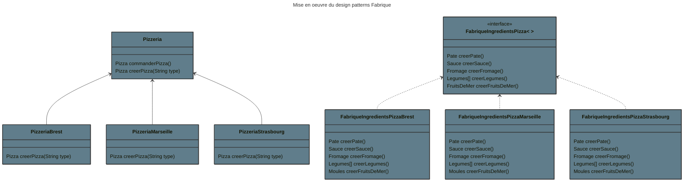
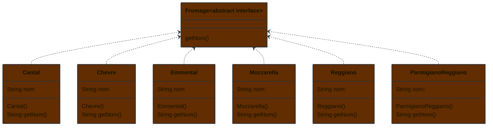

# Mise en oeuvre du design pattern Fabrique
Le pattern Fabrication définit une interface pour la
création d’un objet, mais en laissant aux sous-classes le
choix des classes à instancier. Fabrication permet à une
classe de déléguer l’instanciation à des sous-classes.

Comme toute fabrication, le pattern Fabrication nous offre un moyen d’encapsuler
l’instanciation de types concrets. Si vous observez le diagramme de classes ci-
dessous, vous constaterez que le Créateur abstrait vous fournit une interface
dotée d’une méthode permettant de créer des objets, alias « fabrication ». Toutes
les autres méthodes implémentées dans le Créateur abstrait sont écrites pour
opérer sur les produits créés par la fabrique. Seules les sous-classes implémentent
réellement la méthode de fabrique et créent des produits.
Comme dans la définition officielle, vous entendrez souvent des développeurs
dire que la Fabrication laisse aux sous-classes le choix des classes à instancier. Ils
parlent de « choix » non seulement parce que le pattern permet aux sous-classes
elles-mêmes de décider au moment de l’exécution, mais aussi parce que la classe
créatrice ne sait rien des produits réels qui seront créés, choix qui appartient
entièrement à la sous-classe utilisée.

Les Fabriques gèrent les détails de la création des objets. Une fois que nous
avons une SimpleFabriqueDePizzas, notre méthode commanderPizza() devient
simplement un client de cet objet. Chaque fois qu’elle aura besoin d’une pizza,
elle demandera à la fabrique de pizzas de lui en faire une. Le temps n’est plus
où la méthode commanderPizza() devait savoir si la pizza était aux poivrons ou
aux fruits de mer. Maintenant, une seule chose lui importe : obtenir une pizza
qui implémente l’interface Pizza afin de pouvoir appeler preparer(), cuire(),
couper() et emballer().

```mermaid

classDiagram

    direction TB
    
class Pizza~abstract interface~{
        String nom
        Pate pate
        Sauce sauce
        Legumes[] legumes
        Fromage fromage
        FruitsDeMer fruitsDeMer
        float prix
        preparer()
        couper()
        emballer()
        setNom(String nom)
        String getNom()
        void printLegumes()
        void setPrix(float prix)
        String toString()
    }
    class PizzaFromageStyleStrasbourg{
        FabriqueIngredientsPizza
        PizzaFromageStyleStrasbourg(FabriqueIngredientsPizza)
        preparer()
        couper()
        cuire()
    }
    class PizzaFruitsDeMer{
        FabriqueIngredientsPizza
        PizzaFruitsDeMer(FabriqueIngredientsPizza)
        preparer()
    }
    class PizzaFruitsDeMerStyleBrest{
        FabriqueIngredientsPizza
        PizzaFruitsDeMerStyleBrest(FabriqueIngredientsPizza)
        preparer()
    }
    class PizzaFruitsDeMerStyleMarseille{
        FabriqueIngredientsPizza
        PizzaFruitsDeMerStyleMarseille(FabriqueIngredientsPizza)
        preparer()
    }
    class PizzaFruitsDeMerStyleStrasbourg{
        FabriqueIngredientsPizza
        PizzaFruitsDeMerStyleStrasbourg(FabriqueIngredientsPizza)
        preparer()
    }
    class PizzaVegetarienne{
        FabriqueIngredientsPizza
        PizzaVegetarienne(FabriqueIngredientsPizza)
        preparer()
    }
    class PizzaFromageStyleBrest{
        FabriqueIngredientsPizza
        PizzaFromageStyleBrest(FabriqueIngredientsPizza)
        preparer()
        couper()
        cuire()
    }
    class PizzaPoivrons{
        FabriqueIngredientsPizza
        PizzaPoivrons(FabriqueIngredientsPizza)
        preparer()
        couper()
        emballer()
    }
    
    Pizza <-- PizzaFromageStyleStrasbourg
    Pizza <-- PizzaFruitsDeMerStyleBrest
    Pizza <-- PizzaFruitsDeMerStyleMarseille
    Pizza <-- PizzaFruitsDeMer
    Pizza <-- PizzaFruitsDeMerStyleStrasbourg
    Pizza <-- PizzaVegetarienne
    Pizza <-- PizzaFromageStyleBrest
    Pizza <-- PizzaPoivrons
    
    style Pizza fill:#10508b,stroke:#333,stroke-width:2px
    style PizzaFromageStyleBrest fill:#10508b,stroke:#333,stroke-width:2px
    style PizzaFromageStyleStrasbourg fill:#10508b,stroke:#333,stroke-width:2px
    style PizzaFruitsDeMer fill:#10508b,stroke:#333,stroke-width:2px
    style PizzaFruitsDeMerStyleBrest fill:#10508b,stroke:#333,stroke-width:2px
    style PizzaFruitsDeMerStyleMarseille fill:#10508b,stroke:#333,stroke-width:2px
    style PizzaFruitsDeMerStyleStrasbourg fill:#10508b,stroke:#333,stroke-width:2px
    style PizzaPoivrons fill:#10508b,stroke:#333,stroke-width:2px
    style PizzaVegetarienne fill:#10508b,stroke:#333,stroke-width:2px

```

```mermaid

classDiagram

    direction TB
    
    class Pate~abstract interface~{
        getNom()
    }
    class Sauce~abstract interface~{
        getNom()
    }
    class PateEpaisse{
        String nom
        PateEpaisse()
        getNom()
    }
    class PateFine{
        String nom
        PateFine()
        getNom()
    }
    class PateSoufflee{
        String nom
        PateSoufflee()
        getNom()
    }

    class FruitsDeMer{
        String getNom()
    }
    
    class Moules{
        String getNom()
    }
    class MoulesFraiches{
        String getNom()
    }
    class MoulesSurgelees{
        String getNom()
    }
    class Poulpe{
        String getNom()
    }
    
    
    class SauceBolognese{
        String nom;
        SauceBolognese()
        String getNom()
    }
    class SauceMarinara{
        String nom;
        SauceMarinara()
        String getNom()
    }
    class SauceTomateCerise{
        String nom;
        SauceTomateCerise()
        String getNom()
    }
    
    FruitsDeMer <-- Moules
    FruitsDeMer <-- MoulesFraiches
    FruitsDeMer <-- MoulesSurgelees
    FruitsDeMer <-- Poulpe
    
    
    Sauce <.. SauceBolognese
    Sauce <.. SauceMarinara
    Sauce <.. SauceTomateCerise

    Pate <.. PateEpaisse
    Pate <.. PateFine
    Pate <.. PateSoufflee

    style FruitsDeMer fill:#dddddd,stroke:#333,color:#000000,stroke-width:2px
    style Moules fill:#dddddd,stroke:#333,color:#000000,stroke-width:2px 
    style MoulesFraiches fill:#dddddd,stroke:#333,color:#000000,stroke-width:2px
    style MoulesSurgelees fill:#dddddd,stroke:#333,color:#000000,stroke-width:2px
    style Poulpe fill:#dddddd,stroke:#333,color:#000000,stroke-width:2px
    style Sauce fill:#00008b,stroke:#333,stroke-width:2px
    style SauceBolognese fill:#00008b,stroke:#333,stroke-width:2px
    style SauceMarinara fill:#00008b,stroke:#333,stroke-width:2px
    style SauceTomateCerise fill:#00008b,stroke:#333,stroke-width:2px
    
    style Pate fill:#800000,stroke:#333,stroke-width:2px
    style PateEpaisse fill:#800000,stroke:#333,stroke-width:2px
    style PateFine fill:#800000,stroke:#333,stroke-width:2px
    style PateSoufflee fill:#800000,stroke:#333,stroke-width:2px

```

```mermaid

classDiagram

    direction TB
    
    class Ail{
        String nom
        Ail()
        String getNom()
    }
    class Aubergine{
        String nom
        Aubergine()
        String getNom()
    }
    class Champignon{
        String nom
        Champignon()
        String getNom()
    }
    class Ciboulette{
        String nom
        Ciboulette()
        String getNom()
    }
    class Epinards{
        String nom
        Epinards()
        String getNom()
    }
    class Poivron{
        String nom
        Poivron()
        String getNom()
    }
    class PoivronRouge{
        String nom
        PoivronRouge()
        String getNom()
    }
    class PoivronsEnRondelles{
        String nom
        PoivronsEnRondelles()
        String getNom()
    }
    class Oignon{
        String getNom()
    }
    class OlivesNoires{
        OlivesNoires()
        String getNom()
    }
    
    Legumes <.. Ail
    Legumes <.. OlivesNoires
    Legumes <.. Oignon
    Legumes <.. Aubergine
    Legumes <.. Champignon
    Legumes <.. Ciboulette
    Legumes <.. Epinards
    Legumes <.. Poivron
    Legumes <.. PoivronRouge
    Legumes <.. PoivronsEnRondelles
    
    style Legumes fill:#009000,stroke:#333,stroke-width:2px
    style Ail fill:#009000,stroke:#333,stroke-width:2px
    style Oignon fill:#009000,stroke:#333,stroke-width:2px
    style OlivesNoires fill:#009000,stroke:#333,stroke-width:2px
    style Aubergine fill:#009000,stroke:#333,stroke-width:2px
    style Champignon fill:#009000,stroke:#333,stroke-width:2px
    style Ciboulette fill:#009000,stroke:#333,stroke-width:2px
    style Epinards fill:#009000,stroke:#333,stroke-width:2px
    style PoivronRouge fill:#009000,stroke:#333,stroke-width:2px
    style Poivron fill:#009000,stroke:#333,stroke-width:2px
    style PoivronsEnRondelles fill:#009000,stroke:#333,stroke-width:2px
    

```

