# Mise en oeuvre du design pattern Fabrique
Les Fabriques gèrent les détails de la création des objets. Une fois que nous
avons une SimpleFabriqueDePizzas, notre méthode commanderPizza() devient
simplement un client de cet objet. Chaque fois qu’elle aura besoin d’une pizza,
elle demandera à la fabrique de pizzas de lui en faire une. Le temps n’est plus
où la méthode commanderPizza() devait savoir si la pizza était aux poivrons ou
aux fruits de mer. Maintenant, une seule chose lui importe : obtenir une pizza
qui implémente l’interface Pizza afin de pouvoir appeler preparer(), cuire(),
couper() et emballer().

```mermaid
---
title: Mise en oeuvre du design patterns Fabrique
---
classDiagram
    class Pizzeria{
        Pizza commanderPizza()
        Pizza creerPizza(String type)
    }
    class PizzeriaBrest{
        Pizza creerPizza(String type)
    }
    class PizzeriaMarseille{
        Pizza creerPizza(String type)
    }
    class PizzeriaStrasbourg{
        Pizza creerPizza(String type)
    }
    Pizzeria <-- PizzeriaBrest
    Pizzeria <-- PizzeriaMarseille
    Pizzeria <-- PizzeriaStrasbourg

    class FabriqueIngredientsPizza~interface~{
        Pate creerPate ()
        Sauce creerSauce()
        Fromage creerFromage()
        Legumes[] creerLegumes()
        FruitsDeMer creerFruitsDeMer()
    }
    class FabriqueIngredientsPizzaBrest{
        Pate creerPate()
        Sauce creerSauce()
        Fromage creerFromage()
        Legumes[] creerLegumes()
        Moules creerFruitsDeMer()
    }
    class FabriqueIngredientsPizzaMarseille{
        Pate creerPate()
        Sauce creerSauce()
        Fromage creerFromage()
        Legumes[] creerLegumes()
        Moules creerFruitsDeMer()
    }
    class FabriqueIngredientsPizzaStrasbourg{
        Pate creerPate()
        Sauce creerSauce()
        Fromage creerFromage()
        Legumes[] creerLegumes()
        Moules creerFruitsDeMer()
    }
    FabriqueIngredientsPizza <.. FabriqueIngredientsPizzaBrest
    FabriqueIngredientsPizza <..FabriqueIngredientsPizzaMarseille
    FabriqueIngredientsPizza <..FabriqueIngredientsPizzaStrasbourg
    
    class Fromage~abstract interface~{
        getNom()
    }
    class Legumes~abstract interface~{
        getNom()
    }
    class Pate~abstract interface~{
        getNom()
    }
    class Sauce~abstract interface~{
        getNom()
    }
    class PateEpaisse{
        String nom
        PateEpaisse()
        getNom()
    }
    class PateFine{
        String nom
        PateFine()
        getNom()
    }
    class PateSoufflee{
        String nom
        PateSoufflee()
        getNom()
    }
    Pate <.. PateEpaisse
    Pate <.. PateFine
    Pate <.. PateSoufflee


class Pizza~abstract interface~{
        String nom
        Pate pate
        Sauce sauce
        Legumes[] legumes
        Fromage fromage
        FruitsDeMer fruitsDeMer
        float prix
        preparer()
        couper()
        emballer()
        setNom(String nom)
        String getNom()
        void printLegumes()
        void setPrix(float prix)
        String toString()
    }
    class PizzaFromageStyleStrasbourg{
        FabriqueIngredientsPizza
        PizzaFromageStyleStrasbourg(FabriqueIngredientsPizza)
        preparer()
        couper()
        cuire()
    }
    class PizzaFruitsDeMer{
        FabriqueIngredientsPizza
        PizzaFruitsDeMer(FabriqueIngredientsPizza)
        preparer()
    }
    class PizzaFruitsDeMerStyleBrest{
        FabriqueIngredientsPizza
        PizzaFruitsDeMerStyleBrest(FabriqueIngredientsPizza)
        preparer()
    }
    class PizzaFruitsDeMerStyleMarseille{
        FabriqueIngredientsPizza
        PizzaFruitsDeMerStyleMarseille(FabriqueIngredientsPizza)
        preparer()
    }
    class PizzaFruitsDeMerStyleStrasbourg{
        FabriqueIngredientsPizza
        PizzaFruitsDeMerStyleStrasbourg(FabriqueIngredientsPizza)
        preparer()
    }
    class PizzaVegetarienne{
        FabriqueIngredientsPizza
        PizzaVegetarienne(FabriqueIngredientsPizza)
        preparer()
    }
    class PizzaFromageStyleBrest{
        FabriqueIngredientsPizza
        PizzaFromageStyleBrest(FabriqueIngredientsPizza)
        preparer()
        couper()
        cuire()
    }
    class PizzaPoivrons{
        FabriqueIngredientsPizza
        PizzaPoivrons(FabriqueIngredientsPizza)
        preparer()
        couper()
        emballer()
    }
    Pizza <-- PizzaFromageStyleStrasbourg
    Pizza <-- PizzaFruitsDeMerStyleBrest
    Pizza <-- PizzaFruitsDeMerStyleMarseille
    Pizza <-- PizzaFruitsDeMer
    Pizza <-- PizzaFruitsDeMerStyleStrasbourg
    Pizza <-- PizzaVegetarienne
    Pizza <-- PizzaFromageStyleBrest
    Pizza <-- PizzaPoivrons
    class Ail{
        String nom
        Ail()
        String getNom()
    }
    class Aubergine{
        String nom
        Aubergine()
        String getNom()
    }
    class Cantal{
        String nom
        Cantal()
        String getNom()
    }
    class Champignon{
        String nom
        Champignon()
        String getNom()
    }
    class Chevre{
        String nom
        Chevre()
        String getNom()
    }
    class Ciboulette{
        String nom
        Ciboulette()
        String getNom()
    }
    class Emmental{
        String nom
        Emmental()
        String getNom()
    }
    class Epinards{
        String nom
        Epinards()
        String getNom()
    }
    class Poivron{
        String nom
        Poivron()
        String getNom()
    }
    class PoivronRouge{
        String nom
        PoivronRouge()
        String getNom()
    }
    class PoivronsEnRondelles{
        String nom
        PoivronsEnRondelles()
        String getNom()
    }
    class FruitsDeMer{
        String getNom()
    }
    class Oignon{
        String getNom()
    }
    class OlivesNoires{
        OlivesNoires()
        String getNom()
    }
    class Moules{
        String getNom()
    }
    class MoulesFraiches{
        String getNom()
    }
    class MoulesSurgelees{
        String getNom()
    }
    class Poulpe{
        String getNom()
    }
    FruitsDeMer <-- Moules
    FruitsDeMer <-- MoulesFraiches
    FruitsDeMer <-- MoulesSurgelees
    FruitsDeMer <-- Poulpe


    class Mozzarella{
        String nom;
        Mozzarella()
        String getNom()
    }
    class ParmigianoReggiano{
        String nom;
        ParmigianoReggiano()
        String getNom()
    }
    class Reggiano{
        String nom;
        Reggiano()
        String getNom()
    }
    class SauceBolognese{
        String nom;
        SauceBolognese()
        String getNom()
    }
    class SauceMarinara{
        String nom;
        SauceMarinara()
        String getNom()
    }
    class SauceTomateCerise{
        String nom;
        SauceTomateCerise()
        String getNom()
    }
    Legumes <.. Ail
    Legumes <.. OlivesNoires
    Legumes <.. Oignon
    Legumes <.. Aubergine
    Legumes <.. Champignon
    Legumes <.. Ciboulette
    Legumes <.. Epinards
    Legumes <.. Poivron
    Legumes <.. PoivronRouge
    Legumes <.. PoivronsEnRondelles
    
    Fromage <.. Cantal
    Fromage <.. Chevre
    Fromage <.. Emmental
    Fromage <.. Mozzarella
    Fromage <.. Reggiano
    Fromage <.. ParmigianoReggiano
    
    Sauce <.. SauceBolognese
    Sauce <.. SauceMarinara
    Sauce <.. SauceTomateCerise

```

